{}

B树是一种为磁盘或其他存储设备设计的平衡查找树。目的是降低磁盘的I/O次数，因为使用B树（或B树的变种）的场景，大多是将数据存放在主存之外，内存的存取速度跟磁盘相差十分巨大。接下来就来看看B树是如何降低磁盘存取次数的。

{}

## 什么是B树
B树是一棵N叉树，N可以很大，从几个到几千个。假设结点 x 有 n[x]个关键字，那么结点 x 有 n[x] + 1 的子女，关键字是用来划分子女用。当对B树进行查询时，对结点的 n[x] 个关键字进行比较，从而做出下一步搜索决定。
比如下面是一棵一组数字，的B树：

## B树的定义：
一棵B树T是具有如下性质的有根树（根为root[T]）：

1. 对于每个结点x，它有下面的特点：
  * n[x]代表x中的关键字数
  * n[x]个关键字以非降序存放
  * leaf[x]是一个布尔值，如果x是叶子结点，则为true，否则为false
2. 每个结点x，包含着n[x]+1个子女，它们由n[x]+1个指针ci[x]指着，如果没有子女，则指针域为空
3. 根据关键字对子树的进行划分，满足子树的关键字与子树根的关键字是非降序关系
4. 每个叶子结点拥有相同的深度
5. 每个结点的关键字数是有界限的，最小度数t >= 2：
  * 每个非根结点必须至少有t-1个关键字，至少有t个子女。如果树是非空的，则根结点至少有一个关键字
  * 每个结点最多有2t-1个关键字，最多有2t个子女，如果结点刚好有2t-1个关键字，那么该结点是`满`的

## B树的基本操作
### 搜索B树
在对B树进行搜索时，与二叉树是相似的，不同的是，二叉树是一个两路选择，而B树中是根据子女数做一个n[x]+1路的决定。

1. 当查找关键字为k时，我们传入树的根结点进行查找，线性遍历关键字，如果查询到k=key[i]，则返回结果。
2. 否则读出key[i]对应的子树，重新进行递归查找。
3. 如果直到叶子结点，依旧没有找到k=key[i]的关键字，则查找失败。

假设我们要查询关键字25，那么标红的是查找时需要经过的结点

### 向B树插入关键字
向B树插入一个关键字，不能简单的创建一个叶子结点，然后将其插入树中，因为这样操作会破坏B树的结构。

我们需要将关键字插在已有叶子结点上，假如叶子结点已经是满了（关键字数为2t-1），那么需要进行分裂（后续会说到如何分裂）。

插入关键字与查找一样，是从根往下走，过程中，如果遇到结点（包含叶子结点）已经是满的情况时，则进行分裂。
所以不会等到发现一个结点需要分裂才能插入的情况。

#### 结点分裂
当一个结点已经满了时，要向其插入关键字前，需要先进行结点分裂。

结点分裂是一个向上的过程，满的结点关键字数有2t-1个，取中间的关键字，左右两边的关键字各分裂成一个结点，中间关键字向上提升。

前面提过，分裂的时机是当发现一个结点已经是满的情况时，则进行分裂。所以在由上而下插入关键字时，能确保分裂时关键字的提升不会因为双亲结点是满的而失败。

#### 搜索并插入关键字

现在我们向前面展示过的树插入一个关键字`40`。

假定该树的度数t为2，那么结点关键字2t-1=3为满。可见，我们要插入的那个叶子结点已经处于满的状态，需要进行分裂。
将`41`提升到双亲结点，叶子结点分裂后，插入关键字`40`。

现在我们要插入另外一个关键字`20`，插入的过程中发现结点(10 30 41)满了，进行分裂，成功后继续向下插入。

### 从B树中删除关键字
删除与插入操作类似，不同的是，当插入关键字时，是插入到叶子结点中，然而删除却可以操作到任意一个结点，因此要复杂一点。

如果结点是内部结点，删除时需要重新安排结点的子女。与此同时，还得保证B树的结构不被破坏，当删除了关键字后，结点的关键字个数不满足最小关键字数，需要进行合并操作。

删除操作来说相对复杂，这里引用「算法导论」的删除例子，并加以说明：

这是一棵度数t=3的树，意味着非根结点至少有t-1=2个关键字，至少有t=3个子女，每个结点最多有2t-1=5个关键字，最多有2t=6个子女

删除关键字F：关键字直接从叶子结点中删除

删除关键字M：M位于内结点，位于M前面的子结点(J K L)至少包含t个关键字，删除L提至父结点，取代关键字M

删除关键字G：G的两个子结点都只有t-1个关键字，G下降并合并两个子结点，组成(D E G J K)，然后将G删除

删除关键字D：关键字不在(P)中，子结点(C L)(T X)都只包含t-1个关键字，将它们两个合并，P下降到子节点中

将关键字D删除（与删除关键字F相同：直接从叶子结点中删除）

树高度减少1

删除关键字B：结点(A B)只有t-1个关键字，相邻结点(E J K)包含该t个关键字，删除关键字B，关键字C下降到子结点填补B的位置，关键字E提升到父节点填补C的位置

## B+树
B+树是B树的一种变体，区别之处在于：

1. B+树的内部结点不存放数据，数据只存放在叶子结点；
2. 所有叶子结点串成一条有序链表，在遍历数据时尤其方便。

这两点区别是非常有用的，由于内部结点只存放索引信息，那么结点就可以存放更多的关键字，进而使得关键字查询次数减少，我们知道，B树/B+树是专门为I/O所做的数据结构，那么I/O次数的减少，势必大大提升查询速度。

叶子结点的相连，使得区间查询和搜索变得方便，当查询一个区间时，只需要查到第一个关键字所在的位置，后面的数据通过链表遍历便能得到。对比B树，后者需要进行每一层的递归遍历，区间查询的性能肯定不如B+树高。

*因为B+树的特点，被广泛用作数据库索引的数据结构*
