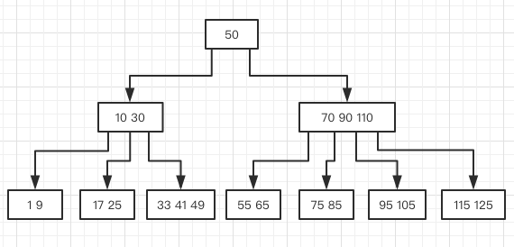

{}
B树是一种为磁盘或其他存储设备设计的平衡查找树。目的是降低磁盘的I/O次数，因为使用B树（或B树的变种）的场景，大多是将数据存放在主存之外，内存的存取速度跟磁盘相差十分巨大。接下来就来看看B树是如何降低磁盘存取次数的。

{}

## B树是怎么样的
B树是一个N叉树，N可以很大，从几个到几千个。假设结点 x 有 n[x]个关键字，那么结点 x 有 n[x] + 1 的子女，关键字是用来划分子女用。当对B树进行查询时，对结点的 n[x] 个关键字进行比较，从而做出下一步搜索决定。
比如下面是一棵一组数字的B树：

## B树的定义
todo

## 对B树的操作

### 搜索

### 插入

### 结点分裂

#### 删除

## B+树
