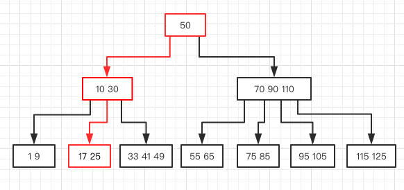

{}
B树是一种为磁盘或其他存储设备设计的平衡查找树。目的是降低磁盘的I/O次数，因为使用B树（或B树的变种）的场景，大多是将数据存放在主存之外，内存的存取速度跟磁盘相差十分巨大。接下来就来看看B树是如何降低磁盘存取次数的。

{}

## 什么是B树
B树是一课N叉树，N可以很大，从几个到几千个。假设结点 x 有 n[x]个关键字，那么结点 x 有 n[x] + 1 的子女，关键字是用来划分子女用。当对B树进行查询时，对结点的 n[x] 个关键字进行比较，从而做出下一步搜索决定。
比如下面是一棵一组数字的B树：

## B树的定义：
一棵B树T是具有如下性质的有根树（根为root[T]）：

1. 对于每个结点x，它有下面的特点：
  * n[x]代表x中的关键字数
  * n[x]个关键字以非降序存放
  * leaf[x]是一个布尔值，如果x是叶子结点，则为true，否则为false
2. 每个结点x，包含着n[x]+1个子女，它们由n[x]+1个指针ci[x]指着，如果没有子女，则指针域为空
3. 根据关键字对子树的进行划分，满足子树的关键字与子树根的关键字是非降序关系
4. 每个叶子结点拥有相同的深度
5. 每个结点的关键字数是有界限的，最小度数t >= 2：
  * 每个非根结点必须至少有t-1个关键字，至少有t个子女。如果树是非空的，则根结点至少有一个关键字
  * 每个结点最多有2t-1个关键字，最多有2t个子女，如果结点刚好有2t-1个关键字，那么该结点是`满`的

## B树的基本操作
{}
在对B树进行搜索时，与二叉树是相似的，不同的是，二叉树是一个两路选择，而B树中是根据子女数做一个n[x]+1路的决定。

1. 当查找关键字为k时，我们传入树的根结点进行查找，线性遍历关键字，如果查询到k=key[i]，则返回结果。
2. 否则读出key[i]对应的子树，重新进行递归查找。
3. 如果直到叶子结点，依旧没有找到k=key[i]的关键字，则查找失败。

假设我们要查询关键字25，那么标红的是查找时需要经过的结点

{}

### 插入

### 结点分裂

#### 删除

## B+树
