{}

B树是一种为磁盘或其他存储设备设计的平衡查找树。目的是降低磁盘的I/O次数，因为使用B树（或B树的变种）的场景，大多是将数据存放在主存之外，内存的存取速度跟磁盘相差十分巨大。接下来就来看看B树是如何降低磁盘存取次数的。

{}

## 什么是B树
B树是一棵N叉树，N可以很大，从几个到几千个。假设结点 x 有 n[x]个关键字，那么结点 x 有 n[x] + 1 的子女，关键字是用来划分子女用。当对B树进行查询时，对结点的 n[x] 个关键字进行比较，从而做出下一步搜索决定。
比如下面是一棵一组数字，的B树：

## B树的定义：
一棵B树T是具有如下性质的有根树（根为root[T]）：

1. 对于每个结点x，它有下面的特点：
  * n[x]代表x中的关键字数
  * n[x]个关键字以非降序存放
  * leaf[x]是一个布尔值，如果x是叶子结点，则为true，否则为false
2. 每个结点x，包含着n[x]+1个子女，它们由n[x]+1个指针ci[x]指着，如果没有子女，则指针域为空
3. 根据关键字对子树的进行划分，满足子树的关键字与子树根的关键字是非降序关系
4. 每个叶子结点拥有相同的深度
5. 每个结点的关键字数是有界限的，最小度数t >= 2：
  * 每个非根结点必须至少有t-1个关键字，至少有t个子女。如果树是非空的，则根结点至少有一个关键字
  * 每个结点最多有2t-1个关键字，最多有2t个子女，如果结点刚好有2t-1个关键字，那么该结点是`满`的

## B树的基本操作
### 搜索B树
在对B树进行搜索时，与二叉树是相似的，不同的是，二叉树是一个两路选择，而B树中是根据子女数做一个n[x]+1路的决定。

1. 当查找关键字为k时，我们传入树的根结点进行查找，线性遍历关键字，如果查询到k=key[i]，则返回结果。
2. 否则读出key[i]对应的子树，重新进行递归查找。
3. 如果直到叶子结点，依旧没有找到k=key[i]的关键字，则查找失败。

假设我们要查询关键字25，那么标红的是查找时需要经过的结点

### 向B树插入关键字
向B树插入一个关键字，不能简单的创建叶子结点，然后将其插入，因为这样操作的话，那么将破坏B树的结构。

我们需要将关键字插在已有叶子结点上，假如叶子结点已经是满了（关键字数为2t-1），那么需要进行分裂（后续会说到如何分裂）。

插入关键字与查找一样，是从根往下走，过程中，如果遇到结点（包含叶子结点）已经是满的情况时，则进行分裂。
所以不会等到发现一个结点需要分裂才能插入的情况。

#### 结点分裂
当一个结点已经满了时，要向其插入关键字前，需要先进行结点分裂。

结点分裂是一个向上的过程，满的结点关键字数有2t-1个，取中间的关键字，左右两边的关键字各分裂成一个结点，中间关键字向上提升。

前面提过，分裂的时机是当发现一个结点已经是满的情况时，则进行分裂。所以在由上而下插入关键字时，能确保分裂时关键字的提升不会因为双亲结点是满的而失败。

#### 搜索并插入关键字

现在我们向前面展示过的树插入一个关键字`40`。

假定该树的度数t为2，那么结点关键字2t-1=3为满。可见，我们要插入的那个叶子结点已经处于满的状态，需要进行分裂。
将`41`提升到双亲结点，叶子结点分裂后，插入关键字`40`。

现在我们要插入另外一个关键字`20`，插入的过程中发现结点(10 30 41)满了，进行分裂，成功后继续向下插入。

### 从B树中删除关键字

## B+树
