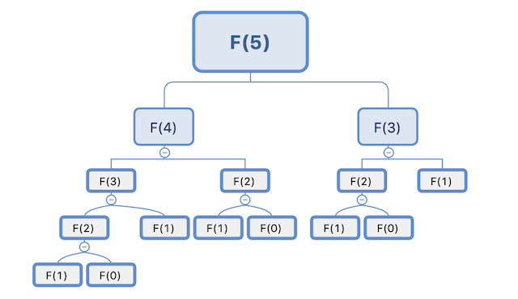
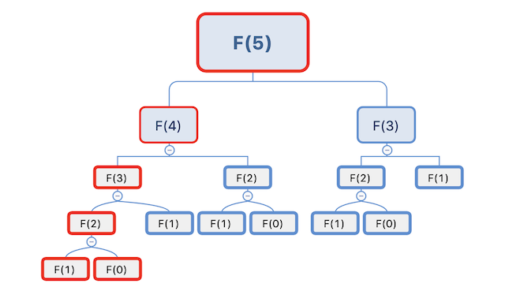

直接看理论枯燥无味，且印象不深，我们先从一些简单的例子开始，从而引出对应的知识点。

## 从斐波拉契说起

关于斐波拉契数列，大家应该很熟悉了，它的定义公示如下：

``` shell
Fibonacci(n) = Fibonacci(n-1) + Fibonacci(n-2)

其中：Fibonacci(0) = 1，Fibonacci(1) = 1
```

作为递归的经典入门例子，我们很快能想到它的递归解法：

``` Go
func fibonacci(n int) int {
        if n == 0 || n == 1 {
                return 1
        }
        return fibonacci(n-1) + fibonacci(n-2)
}
```

假设我们现在根据上面的递归代码要求出F(5)的值，按照递归铺开，可以得到下面这个计算过程：



可以明显看到，里面有某些值是重复计算的，比如：F(2)就计算了3次。

我们可以对代码做一下优化：

``` Go
func fibonacci(n int) int {
	if n == 0 || n == 1 {
		return 1
	}
	res := make([]int, n+1)
	res[0] = 1
	res[1] = 1
	for i := 2; i <= n; i++ {
		res[i] = res[i-1] + res[i-2]
	}
	return res[n]
}
```

采用自底向上的方法，将过程中的计算结果保存起来，那么问题就变成了求解红色框框部分：



```
到了这里，我们引入了动态规划的其中一个特性：「重复子问题」

重复子问题是指，问题的子问题之间是不独立的，一个子问题在后续阶段的决策中，可能会被多次用到。
利用这个特性，动态规划算法会将计算结果保存起来，避免子问题的重复计算。
```

那么问题到了这里就结束了吗，并不是，`重复子问题`只是动态规划的其中一个特性，动态规划还有另外两个特性：`最优子结构`、`无后效性`，我们接下来就来分析它。

## 爬楼梯

我们对斐波那契数列换一个描述：

有一条n格的楼梯在我们面前，我们一次可以走一格、或者走两格，请问，要到达第最顶端，我们可以有多少种爬法？

我们要到达第n格，可以有两种方式：

1. 到达第(n-1)格后，走一格；
2. 到达第(n-2)格后，走两格。

也就是说，到达第n格的方法等于到达第(n-1)格的方法加上到达第(n-2)格的方法。

```
f(n) = f(n-1) + f(n-2)
```

f(n-1) 和 f(n-2) 是 f(n) 的子问题，f(n) 的最优解可以从这两个子问题得到，因为这两个子问题本身也属于`最优解`，所以，我们称之为「最优子结构」。

f(n) 只需要知道 f(n-1) 和 f(n-2) 的值是多少，而并不关心它们究竟是怎么得到的，同时，一旦它们的值确定之后，不会受到后面的阶段影响，称之为「无后效性」。

## 总结

通过上面的简单例子，我们知道了动态规划的三个特性，动态规划能解决的有些问题复杂许多，我们留待后面的章节继续。

总结动态规划的三个特征：

* 重复子问题：不同的决策序列，到达某个相同的阶段时，可能会产生重复的状态；
* 最优子结构：可以通过子问题的最优解，推导出问题的最优解；
* 无后效性：推导后面阶段状态时，只关心前面阶段状态的值，不关心是怎么得到的；某阶段状态一旦确定，不受后面阶段影响。
